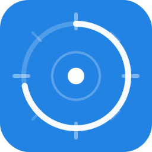

# Focus Score

A Notion-integrated focus timer that tracks your time estimation accuracy. Embed it directly in your Notion workspace.

<p align="center">
  
</p>

## Features

- **Notion sync** — pull tasks from any database, write actual time back on completion
- **Multi-timer** — run several tasks in parallel with individual countdown rings
- **Estimation scoring** — earn XP for accurate estimates, build streaks
- **Survives refresh** — timer state persists across page reloads and Notion embed restarts
- **Sound + notifications** — beep and browser notification when a countdown expires
- **Retry queue** — failed Notion writes are queued and retried automatically
- **Focus music** — embedded YouTube player (privacy-respecting `youtube-nocookie.com`)
- **Notion-native design** — matches Notion UI, supports light and dark mode
- **Zero dependencies** — single HTML file, no build step, no npm

## Quick Start

### Deploy to Vercel (recommended)

1. **Fork** this repo or push it to your GitHub account
2. Go to [vercel.com/new](https://vercel.com/new) → import the repo → **Deploy**
3. In Vercel project settings → Environment Variables, add:
   ```
   NOTION_API_KEY = secret_...
   ```
4. In Notion, type `/embed` and paste your Vercel URL

### Set Up Notion

1. Create an integration at [notion.so/my-integrations](https://www.notion.so/my-integrations)
2. Share your task database with the integration (database → `···` → Connections)
3. Your database should have:
   | Property | Type | Purpose |
   |----------|------|---------|
   | Task | Title | Task name (auto-detected) |
   | Est. Time | Number | Estimated minutes |
   | Actual Time | Number | Written back by Focus Score |
   | Status | Status | Optional — filter by "Not started", "In progress" |

4. Open the widget → **Einstellungen** → enter your database URL → **Schema erkennen** → **Speichern**

## Project Structure

```
focuscore/
├── index.html              # The widget (single-file, zero deps)
├── api/
│   └── notion.js           # Vercel serverless proxy (hardened)
├── worker.js               # Alternative: Cloudflare Worker proxy
├── vercel.json             # Vercel routing
├── focuscore-icon.svg      # App icon
├── .github/
│   ├── ISSUE_TEMPLATE/     # Bug report + feature request forms
│   ├── PULL_REQUEST_TEMPLATE.md
│   └── FUNDING.yml
├── CHANGELOG.md
├── CODEOWNERS
├── CODE_OF_CONDUCT.md
├── CONTRIBUTING.md
├── LICENSE
├── README.md
└── SECURITY.md
```

## Architecture

```
Browser (Notion embed)
    ↕ fetch()
Vercel Serverless Function (/api/notion)
    ↕ NOTION_API_KEY from ENV
Notion API (api.notion.com)
```

The proxy exists because Notion's API blocks browser CORS requests. It adds CORS headers and enforces a **path allowlist** — only `/v1/databases/` and `/v1/pages/` are forwarded. The API key lives server-side as an environment variable and never reaches the browser.

## Alternative: Cloudflare Worker

If you prefer Cloudflare over Vercel, deploy `worker.js` as a Cloudflare Worker and switch the widget to "Custom Proxy" mode in settings. See [CONTRIBUTING.md](CONTRIBUTING.md) for details.

## Security

See [SECURITY.md](SECURITY.md) for the security policy and vulnerability reporting process. Key points:

- API key is stored server-side (Vercel ENV), not in the browser
- Proxy enforces a path allowlist
- CSP meta tag restricts script sources and frame origins
- YouTube embeds use `youtube-nocookie.com`

## Contributing

See [CONTRIBUTING.md](CONTRIBUTING.md) for setup instructions, commit conventions, and the pull request process.

## License

[MIT](LICENSE)
